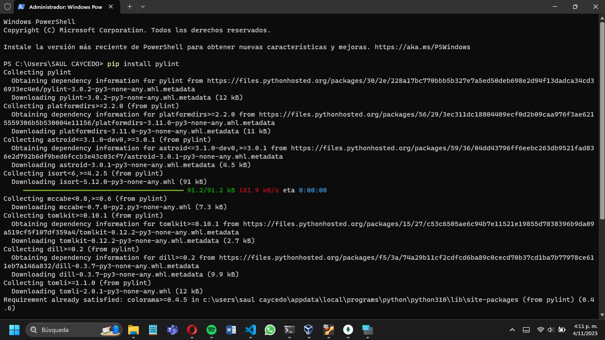
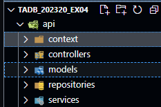
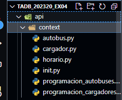
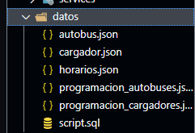

# **Aplicación de Gestión de Transporte Público**

Esta aplicación de gestión de transporte público se ejecuta utilizando **Visual Studio Code** con **Python** incluido como **IDE** y **MongoDB** como motor de base de datos.

## **Requisitos Previos:**

- [Visual Studio Code](https://code.visualstudio.com/download).

- [MongoDB](https://www.mongodb.com/try).

## **Plugin:**

- Instalaremos [pylint](https://pypi.org/project/pylint/) que es para reconocer errores con:

```
pip install pylint
```



- Instalaremos [pymongo](https://pypi.org/project/pymongo/) para conectarnos a **MongoDB** desde **Python**:

```
pip install pymongo
```


## **Configuración del proyecto:**

- Una vez instalado los componentes anteriores, deben configurar su proyecto en **Visual Studio Code**, crear los archivos y carpetas necesarias, y escribir el Código de la aplicación de gestión de transporte público.

## **Conexión a MongoDB:**

- Asegurarse de que la aplicación este configurada para conectarse a la instancia de **MondgoDB**. Esto implica establecer la dirección y el puerto de la base de datos.

- Una vez que hayan completado estos pasos, podrán ejecutar y trabajar en la aplicación de gestión de transporte público en nuestro entorno de desarrollo.

# **Estructura del proyecto:**

**1.** Crear un archivo llamado **api**.


**2.** Luego de esa **api**, crear otros archivos que serán la estructura de la API, son 5 subcarpetas.



**3.** Luego de crear esas subcarpetas, crear 6 archivos y asi con las otras subcarpetas.



**4.** Luego crear una carpeta fuera de la **API** se va a llamar datos ahi va a encontrar 5 archivos JSON (**query's**) y el script del modelo.



## **Estructura del proyecto:**

- En general el proyecto también contiene la estructura del diagrama relacional.


- Así quedaria la estructura para que funcione, si no lo hacen de esta forma tendrán problemas de ejecución.
